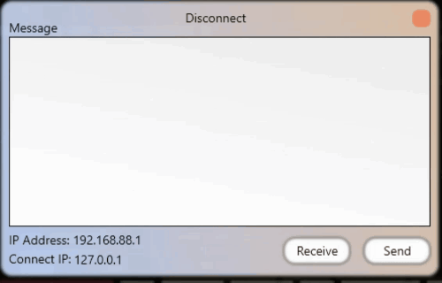

<h1 align="center">near-msg</h1>

------

😄 Near Message is a program to communicate with your friend. I have a short story "I was an SHS student gamer in a computer shop and also we called 'com shop tambay' soddenly I want to talk with my friend secretly without knowing other." that's why I remember that time now I decide to build near-msg to free near chat to there friends. 

##### ༼ つ ◕_◕ ༽つ Usage:

Receive:📝	 	button for receiving data from sender

Send:🏹 			button to send data to recever

127.0.0.1:🛠	  you can change the IP to connect your friend.

##### Basic Requirements:

Windows 10 or Windows 11 because the .net framework version 4 is built for that os, its working on windows 7 but you need to install .net framework version 4 if you want 😊

